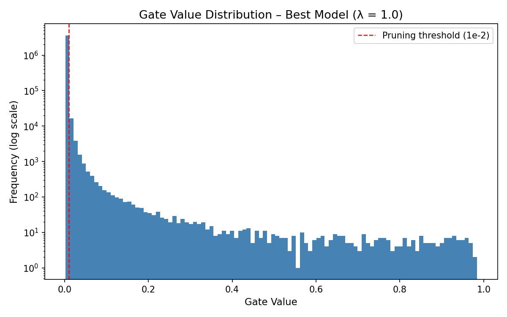

# Self-Pruning Neural Network

This project implements a neural network that learns to prune its own weights during training.

## Approach

Each weight is multiplied by a learnable gate (value between 0 and 1).  
During training, an L1 penalty is applied on these gates so that less important ones move toward zero, effectively removing those connections.

## Results

For λ = 0.01, the model achieved around 56.9% accuracy with about 10% sparsity, meaning very little pruning happened.

When λ was increased to 0.1, sparsity jumped to nearly 70%, and interestingly, accuracy slightly improved to about 57.2%. This suggests that moderate pruning helped remove unnecessary connections and improved generalization.

At λ = 1.0, the network became extremely sparse (around 99%), but accuracy dropped to about 54.6%, showing that too much pruning hurts performance.

Overall, this clearly shows the trade-off between sparsity and accuracy.

## Gate Distribution

## How to run

pip install -r requirements.txt  
python main.py
